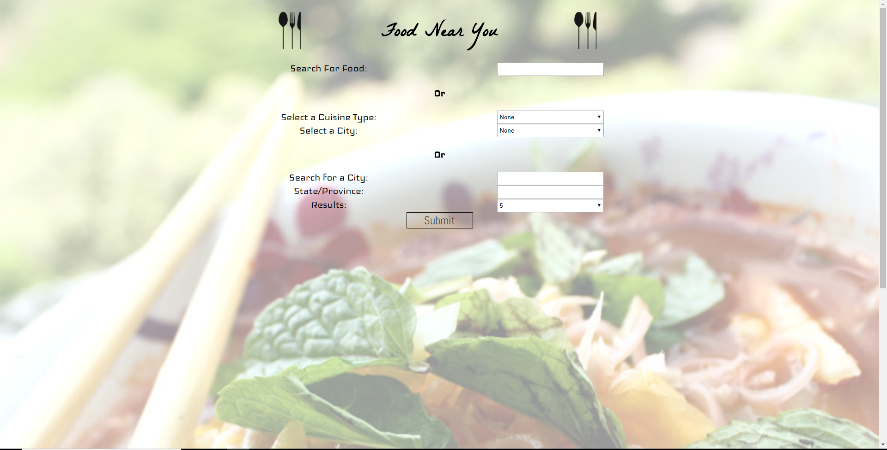
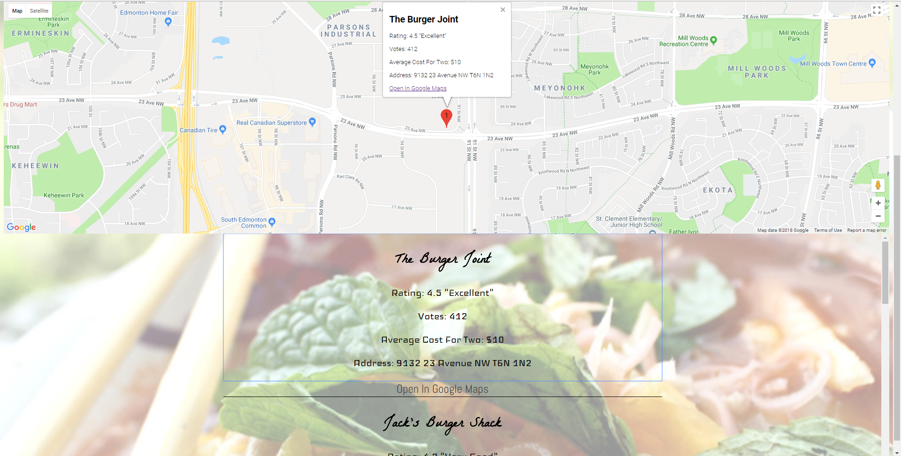

# FoodNearYou

## Demo

https://michaeljoepeterson.github.io/FoodNearYou/

## User input section along with the google maps display

## Results from the user search displayed on google maps

This app allows the user to search for restaurants in their city based on the type of food they want to eat. It grabs the results from Zomato and displays those results as markers on the map, which is generated by Google Maps. It also lists out the results below the map and the user can click on the results which will center the map on the restaurant and display info about the restaurant. Within the results and marker info windows there is a link to google maps which will automatically input the address of the restaurant and display it in google maps. As well, if you are on mobile it will open up the google maps app and display the restaurant location.

## Built With

HTML, CSS, JavaScript, and JQuery

## APIs Used

Zomato API and Google Maps API

## Created by 

Michael Peterson
